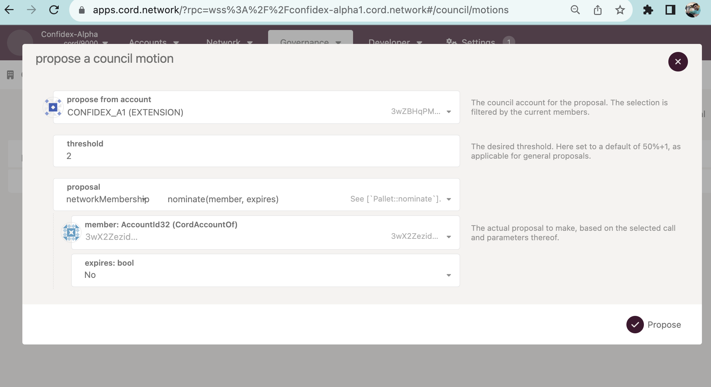
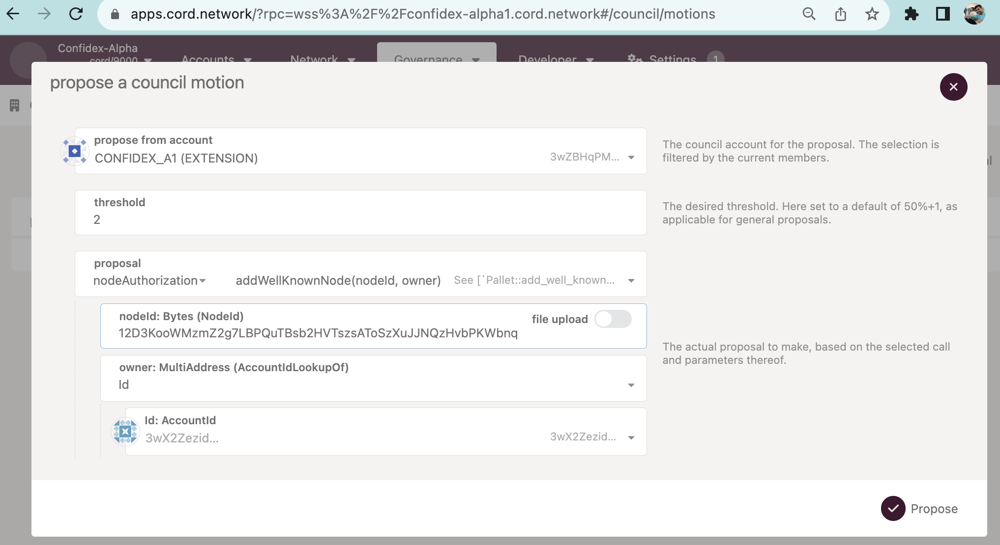

> Pre-Requisite:
> Create [Account](./Account.md) and [Node Key](./Node.md), [Add account to network](./Adding%20Account%20And%20Node%20to%20Network.md)

### Send the account information (public info) to council

Send the information to us through [the google form](https://forms.gle/DXyZR9xj4LseJy1H9)

* AccountId should be from - `docker run -i dhiway/cord:0.9.0 key inspect $SECRET` where SECRET is **'Secret seed'** field from the key generate command.

* Node Key should be from - `docker run -i -v /data:/data dhiway/cord:develop key inspect-node-key --file /data/node.key` command.

## Add account as member (membership)

An existing council member should be making a proposal to add an account as a member.

This step is required if one wants to add an account to 'write' into ledger.

## Add node as well-known node, with the given account.

If anyone wants to add a node, the nodeId (the public part of node.key generated with steps like earlier).

After this is voted successfully by the council, one can start the node. Notice that, one account can have only one nodeId. So, if one wants to run 3 nodes, 3 accounts needs to be created.
