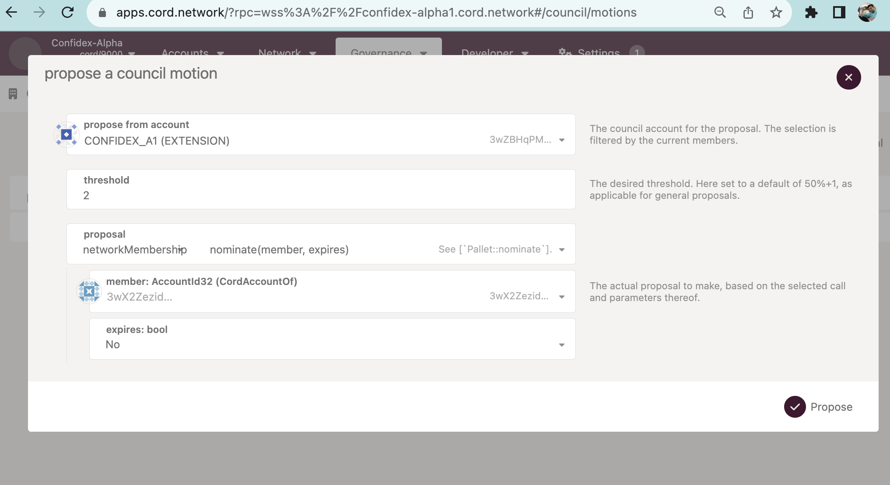
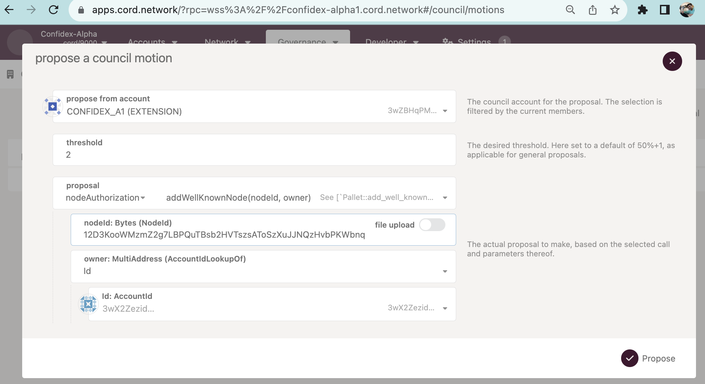
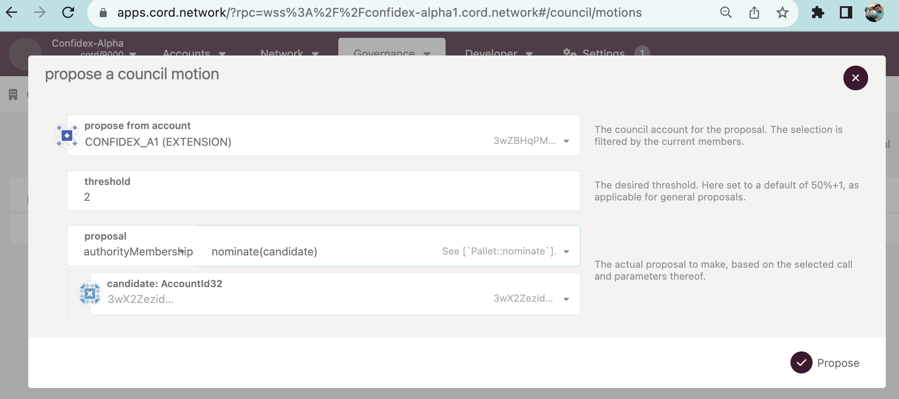
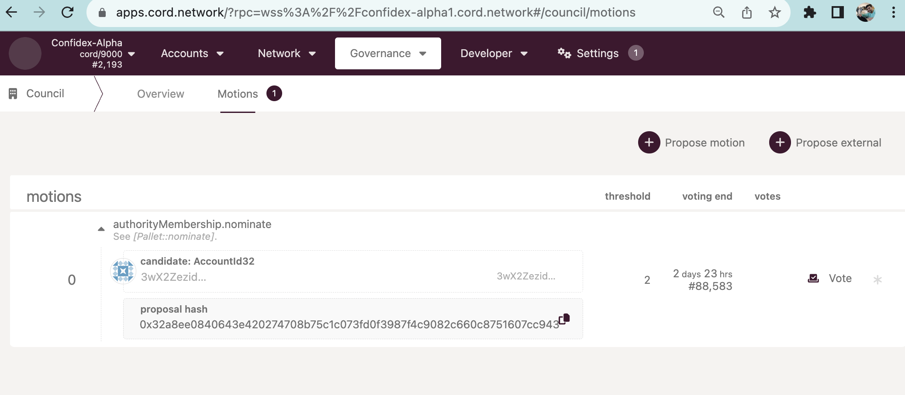

# Confidex Ledger

Confidex (Confidence + Index) is the name for ledger initialized by [ONDC](https://ondc.org). This network is focused on rating and score to start with.

In this document we will try to provide information on how to start and manage the network.


### Network Explorer

Dhiway's [CORD Explorer](https://apps.cord.network) is a key component in managing the ledger. As part of the Confidex network, one can open [this link](https://apps.cord.network/?rpc=wss%3A%2F%2Fconfidex-alpha1.cord.network#/explorer) in your browser. Recommended are Chrome, or Firefox browsers.

### Pre-Requisite

Docker

> [Install Docker](https://docs.docker.com/engine/install/)

Once docker is installed, run below command

```
docker pull dhiway/cord:develop
```


### Create an account and ask for membership.
> [!IMPORTANT]
> Account is associated with only one node, so for creating 'N' nodes, you need 'N' different accounts

You can check [this document](https://docs.cord.network/cord/createaccounts/) for more details of account creation.

Below is the way one would generate an account on CLI.

```
$ docker run -i dhiway/cord:develop key generate -w 24 -n cord
Secret phrase:       climb extend beyond thing romance eyebrow double ocean knee rebuild under cat spare equip furnace manual play million frame spatial double boring crop else
  Network ID:        cord
  Secret seed:       0x1ef83609b52ffb52e926c10a2cb0e08d75d52698597c4f4da65ae872e38a4523
  Public key (hex):  0x76e64f8bd771044f3c1b4bde24b93bd140184a20d9aa631da85b8c9348f17637
  Account ID:        0x76e64f8bd771044f3c1b4bde24b93bd140184a20d9aa631da85b8c9348f17637
  Public key (SS58): 5EkbvZ2xdbAzhZKs154UrnYPp6hffq4FJ7xvZ58HWMLvvec3
  SS58 Address:      5EkbvZ2xdbAzhZKs154UrnYPp6hffq4FJ7xvZ58HWMLvvec3
```

Notice that every execution of the above command would generate a random key. It is very crucial to store the information in a secure way for future use. Specially the **'secret seed'** from the above command, so one can generate the same keys in any machine/application of user's choice.

#### Install polkadot extension

One can install [Polkadot.JS browser extension](https://polkadot.js.org/extension/) which helps in managing the accounts on the laptop.
Import the account created from the above into polkadot extension here using the steps mentioned [here](https://docs.cord.network/cord/createaccounts/)


#### Generate **'node key'**

> [!IMPORTANT]
> A 'node key' is associated with only one node, so for creating 'N' nodes, you need 'N' node keys


In a ledger, each process is not just identified by 'IP:port', but with a specific node-key too, so IP address can change for the given process over time, but node-key is considered as the exact process w.r.to ledger.

`docker run -i -v $(pwd):/data dhiway/cord:develop key generate-node-key --file /data/node.key`

This above command gives the output of public information of nodeKey, something like `12D3KooWMzmZ2g7LBPQuTBsb2HVTszsAToSzXuJJNQzHvbPKWbnq`. This also needs to be stored securely. Also note, similar to key generate, `generate-node-key` too generates a random key for every invocation.


### Send the account information (public info) to council

Send the information to us through [the google form](https://forms.gle/DXyZR9xj4LseJy1H9)

* AccountId should be from - `docker run -i dhiway/cord:develop key inspect $SECRET` where SECRET is **'Secret seed'** field from the key generate command.

* Node Key should be from - `docker run -i -v $(pwd):/data dhiway/cord:develop key inspect-node-key --file /data/node.key` command.


## Add account as member (membership)

An existing council member should be making a proposal to add an account as a member.



This step is required if one wants to add an account to 'write' into ledger.

## Add node as well-known node, with the given account.

If anyone wants to add a node, the nodeId (the public part of node.key generated with steps like earlier).



After this is voted successfully by the council, one can start the node. Notice that, one account can have only one nodeId. So, if one wants to run 3 nodes, 3 accounts needs to be created.


## Starting a data node
A data node contains all the nodes from genesis, it should be used for reads

```
Note: Anyone can join the network after the council votes and closes the motion with successful membership and 'wellKnownNode' addition based on the specific keys of the user.
```
To join the network, one should be using the chain specification file 'confidex-alpha.json' provided in [this repository](https://github.com/dhiway/confidex/). Follow below steps to download the file and start the instance on the node.

Note: if you do not have wget, install it using 'brew install wget' 
or Download the confidex-alpha.json from the browser and skip the first command

On a GNU/Linux node:
```
$ wget -c https://raw.githubusercontent.com/dhiway/confidex/main/confidex-alpha.json
$ docker run --network host --name cord --detach -v $(pwd):/data dhiway/cord:develop --name Confidex-${OrgName} --chain /data/confidex-alpha.json  --node-key-file /data/node.key --base-path /data --pruning=archive
$ docker logs --since 1m -f cord
```

On a Mac instance:
```
$ wget -c https://raw.githubusercontent.com/dhiway/confidex/main/confidex-alpha.json
$ export ORG_ID="DHIWAY" # this can be changed as per your org
$ docker run -p 9944:9944 --name cord --detach -v $(pwd):/data dhiway/cord:develop --name Confidex-${ORG_ID} --chain /data/confidex-alpha.json  --node-key-file /data/node.key --base-path /data --unsafe-rpc-external
$ docker logs --since 1m -f cord
```

Once the logs have messages like below you are successfully started.

```
2023-10-29 15:22:55 🔍 Discovered new external address for our node: /ip4/219.65.110.26/tcp/30333/ws/p2p/12D3KooWJ4Z2e5NZMR23Yrk1YtxnQKRJYJW3h7w4Z9mTUMCy3eTS    
2023-10-29 15:22:57 ✨ Imported #32155 (0xcc33…bb8a)    
2023-10-29 15:22:58 💤 Idle (8 peers), best: #32155 (0xcc33…bb8a), finalized #32152 (0x1395…62a1), ⬇ 10.2kiB/s ⬆ 5.8kiB/s    
```

## Starting a RPC node (used for writes)
A RPC node contains only latest 256 blocks, this node should be used for writes
```
Note: Anyone can join the network after the council votes and closes the motion with successful membership and 'wellKnownNode' addition based on the specific keys of the user.
```

To join the network, one should be using the chain specification file 'confidex-alpha.json' provided in [this repository](https://github.com/dhiway/confidex/). Follow below steps to download the file and start the instance on the node.

Note: if you do not have wget, install it using 'brew install wget' 
or Download the confidex-alpha.json from the browser and skip the first command

On a GNU/Linux node:
```
$ wget -c https://raw.githubusercontent.com/dhiway/confidex/main/confidex-alpha.json
$ docker run --network host --name cord --detach -v $(pwd):/data dhiway/cord:develop --name Confidex-${OrgName} --chain /data/confidex-alpha.json  --node-key-file /data/node.key --base-path /data
$ docker logs --since 1m -f cord
```

On a Mac instance:
```
$ wget -c https://raw.githubusercontent.com/dhiway/confidex/main/confidex-alpha.json
$ export ORG_ID="DHIWAY" # this can be changed as per your org
$ docker run -p 9944:9944 --name cord --detach -v $(pwd):/data dhiway/cord:develop --name Confidex-${ORG_ID} --chain /data/confidex-alpha.json  --node-key-file /data/node.key --base-path /data --unsafe-rpc-external
$ docker logs --since 1m -f cord
```

Once the logs have messages like below you are successfully started.

```
2023-10-29 15:22:55 🔍 Discovered new external address for our node: /ip4/219.65.110.26/tcp/30333/ws/p2p/12D3KooWJ4Z2e5NZMR23Yrk1YtxnQKRJYJW3h7w4Z9mTUMCy3eTS    
2023-10-29 15:22:57 ✨ Imported #32155 (0xcc33…bb8a)    
2023-10-29 15:22:58 💤 Idle (8 peers), best: #32155 (0xcc33…bb8a), finalized #32152 (0x1395…62a1), ⬇ 10.2kiB/s ⬆ 5.8kiB/s    
```

## Adding a new validator into ledger

```
$ docker ps
## make sure no cord process is running
$ docker run -p 9944:9944 --name cord-validator --detach -v $(pwd):/data dhiway/cord:develop --name Confidex-${ORG_ID}-validator --chain /data/confidex-alpha.json  --node-key-file /data/node.key --base-path /data --unsafe-rpc-external --validator --pruning=archive
```
More information on what are the parameters to add for running different type of nodes are present in [CORD Documentation](https://docs.cord.network).

NOTE: A node which started without `--pruning=archive`, you may need to perform `docker run -v $(pwd):/data dhiway/cord:develop purge-chain --chain /data/confidex-alpha.json --base-path /data` before running this.

For becoming 'Validator', there are 2 important steps:

1. set the 'session' keys in the validator process. 
2. needs approval for the given account to be added as the 'authorityMembership'.


After starting the process, one needs to do a 'generate-session-keys' from the secret of the account generated above.

```
docker run -i -v $(pwd):/data dhiway/cord:develop key generate-session-keys --chain /data/confidex-alpha.json  --base-path /data  --suri $SECRET
grandpa: 5GhwzstFiBGozFCHqzXo9TCNvGJbXYf9mdjhx1H8W2UcPkXz
babe: 5HWYN2LpFFxgs6cYEWNkwwuyC8MraS4kaUeCYHo6fDnm9dQT
im_online: 5HWYN2LpFFxgs6cYEWNkwwuyC8MraS4kaUeCYHo6fDnm9dQT
authority_discovery: 5HWYN2LpFFxgs6cYEWNkwwuyC8MraS4kaUeCYHo6fDnm9dQT
Session Keys: 0xcd589e524dd4302e07a7df839abc8792c8994e91e9c5d790ebac7f86a6c1c6f4f0e196aac23e28c4363ee50d43e83da67ab714b30216b2cb898e5593d0f3873cf0e196aac23e28c4363ee50d43e83da67ab714b30216b2cb898e5593d0f3873cf0e196aac23e28c4363ee50d43e83da67ab714b30216b2cb898e5593d0f3873c
```
Once the session keys are generated, one needs to set the session keys using RPC with respective node.


```
$ export SESSIONKEYS=$('Session Keys:' field from above)
$ npx @polkadot/api-cli --seed ${SECRET}  tx.session.setKeys ${SESSIONKEYS} "0x00" --endpoint ws://127.0.0.1:9944
```




## Council activities, and voting for council's motions.




# Run DEMO Script to show 'Score' on ledger


```
cd demo-script/
npm install
npm run demo-score
```
